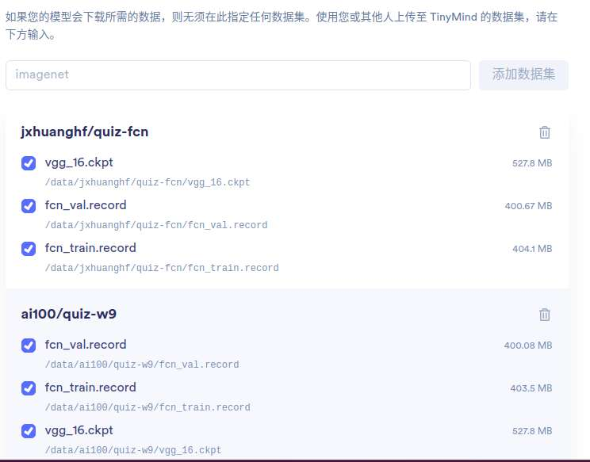
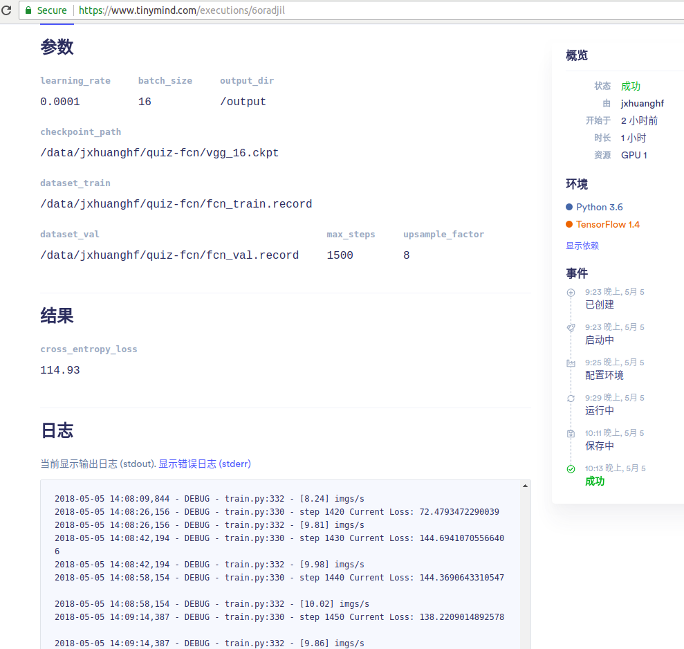
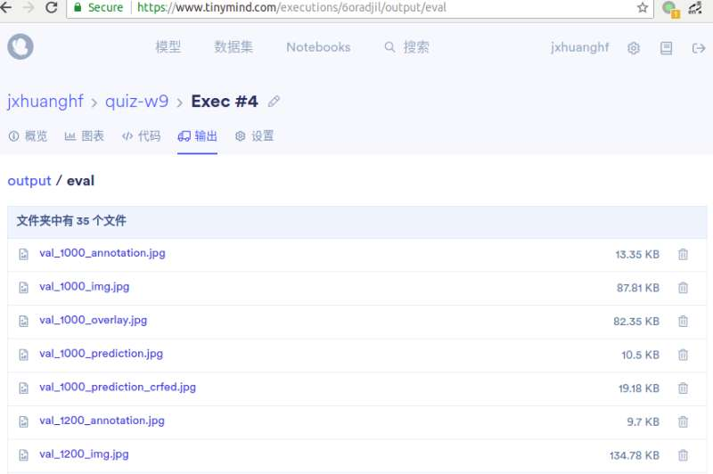
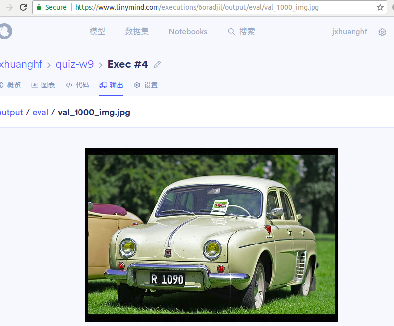
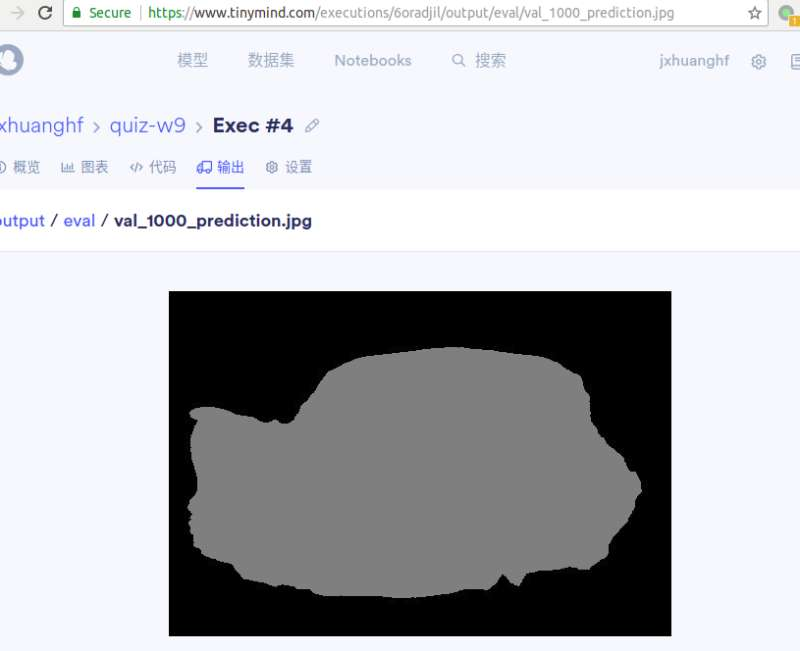
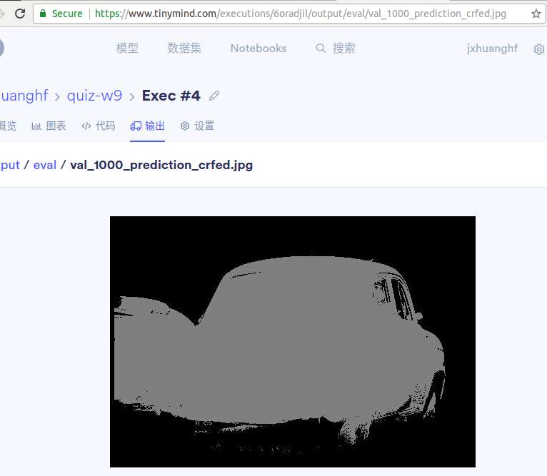

# 第10周作业描述

原作业题目地址https://gitee.com/ai100/quiz-w9-code


### 代码目录结构：
```
├── convert_fcn_dataset.py
├── convert_fcn_dataset.sh
├── data(文件体积太大,超过100M,已经提交到.gitignore了)
│   ├── fcn_train.record
│   ├── fcn_val.record
│   └── vgg_16.ckpt
├── output
├── README.md
├── .gitignore
├── requirements.txt
├── dataset.py
├── train.py
├── train.sh
├── utils.py
├── val_1000_annotation.jpg
├── val_1000_img.jpg
├── val_1000_prediction_crfed.jpg
├── val_1000_prediction.jpg
└── vgg.py

```


### 数据集
- 生成的fcn_train.record,fcn_val.record与tinymind AI100上的数据集,大小上有0.几兆的区别,训练时未发现异常.
- 数据集地址:https://www.tinymind.com/jxhuanghf/datasets/quiz-fcn


### 模型训练完成：
训练结果



### 模型验证结果：
训练完成之后，在**/output/eval**下面生成验证图片



原图 



标签


预测



CRF之后的预测




### 心得体会：
提供一份文档，描述自己的8Xfcn实现，需要有对关键代码的解释。描述自己对fcn的理解。

- fcn模型被称为全卷积网络，可以接受任意大小的输入,里面全部是由卷积构成的
- 对于任何一张输入图片，由于卷积层和池化层的不断作用，得到的输出形状会越来越小，但是通道数会越来越大,到达4096后,通过全连接,输出的通道数等于类别数目.
- fcn-32s 就是直接将最后的结果通过转置卷积扩大 32 倍进行输出，得到与原图一样大小的矩阵,再与进行过onehot编码后的label进行计算交叉熵作损失
- fcn-16x 就是联合前面一次vgg_16/pool4的结果进行 16 倍的输出，
- fcn-8x 就是联合前面两次(vgg_16/pool4, vgg_16/pool4)的结果进行 8 倍的输出
- 
- 概念:
```
转置卷积(上采样):tf函数tf.nn.conv2d_transpose, 卷积的逆过程
双线性内核(bilinear kernel): 上采样时使用的初始权重,不是随机初始化

```
```python
if upsample_factor == 16:
    pass......
elif upsample_factor == 8:  
    pool3_feature = end_points['vgg_16/pool3']
    with tf.variable_scope('vgg_16/fc8'):
        aux_logits_16s = slim.conv2d(pool3_feature, number_of_classes, [1, 1],
                                 activation_fn=None,
                                 weights_initializer=tf.zeros_initializer,
                                 scope='conv_pool3')
    # Perform the upsampling 2X
    upsample_filter_np_x2_2 = bilinear_upsample_weights(2,  # upsample_factor,
                                                      number_of_classes)

    upsample_filter_tensor_x2_2 = tf.Variable(upsample_filter_np_x2_2, name='vgg_16/fc8/t_conv_x2_2')

    upsampled_logits = tf.nn.conv2d_transpose(upsampled_logits, upsample_filter_tensor_x2_2,
                                              output_shape=tf.shape(aux_logits_16s),
                                              strides=[1, 2, 2, 1],
                                              padding='SAME')

    upsampled_logits = upsampled_logits + aux_logits_16s
    # Perform the upsampling 8X
    upsample_filter_np_x8 = bilinear_upsample_weights(upsample_factor,
                                                       number_of_classes)

    upsample_filter_tensor_x8 = tf.Variable(upsample_filter_np_x8, name='vgg_16/fc8/t_conv_x8')
    upsampled_logits = tf.nn.conv2d_transpose(upsampled_logits, upsample_filter_tensor_x8,
                                              output_shape=upsampled_logits_shape,
                                              strides=[1, upsample_factor, upsample_factor, 1],
                                              padding='SAME')


```
